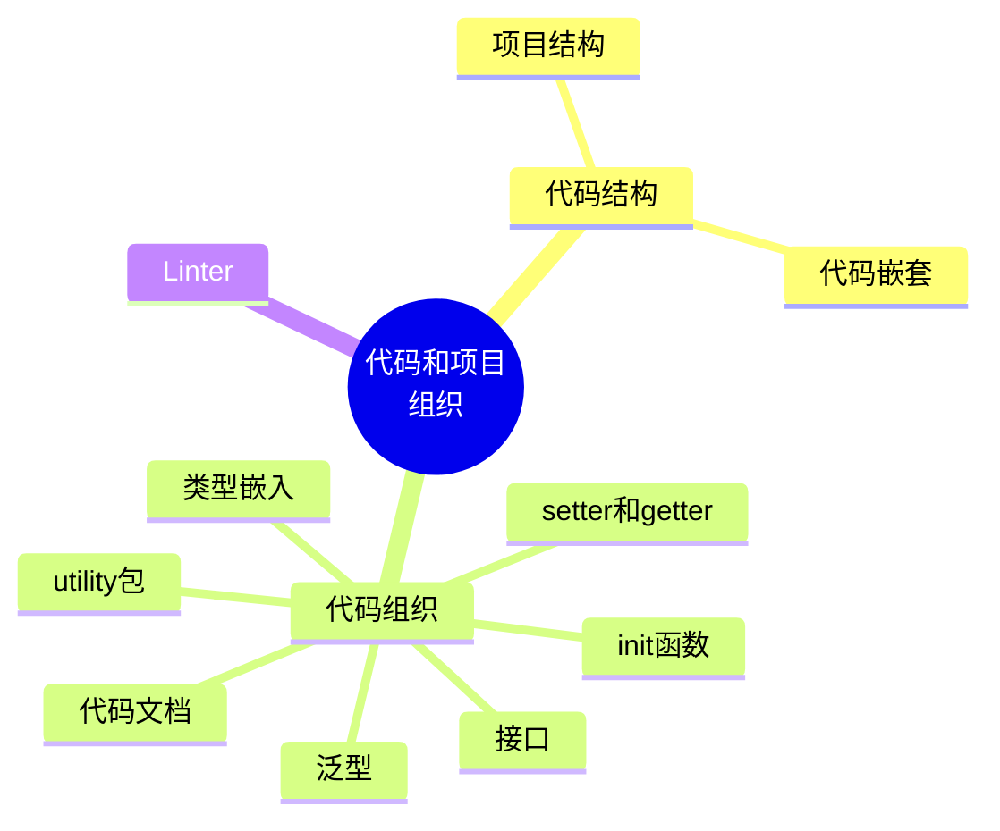
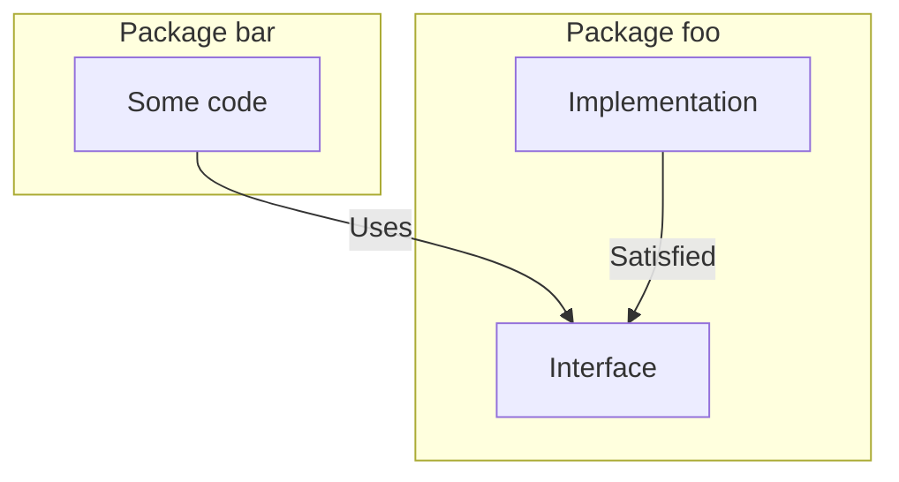
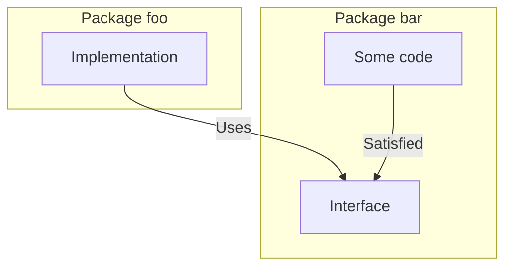

这一章是关于代码和项目的管理方法的，这个方面需要有比较深的经验。有时候我也会比较疑惑，一个项目从零开始的时候应该如何去组织代码，模块应该怎么划分，每个人都会有不同的理解，但是怎样组织才是比较好的方式，是需要积累的。但是这里面应该也是有一些规则来帮助我们更好地去组织代码的。



## 2.1 #1 非预期的变量遮蔽问题

简单的说：内层变量覆盖了外层的变量，导致外层拿到了非预期的变量结果。

示例：
```go
var client *http.Client     // 外层变量                      
if tracing {
    client, err := createClientWithTracing()     
    if err != nil {
        return err
    }
    log.Println(client)
} else {
    client, err := createDefaultClient()         
    if err != nil {
        return err
    }
    log.Println(client)
}
// 这里拿到的 client 永远都是空值 nil
```

解决方法有两个：
```go
// 方法一
var client *http.Client
var err error                                  
if tracing {
    client, err = createClientWithTracing()    
    if err != nil {
        return err
    }
} else {
    // Same logic
}

// 方法二
var client *http.Client
if tracing {
    c, err := createClientWithTracing()    
    if err != nil {
        return err
    }
    client = c                             
} else {
    // Same logic
}
```

但我觉得这两个方法能解决这个问题，但是不能解决根本上的问题：如何防止非预期的变量遮蔽问题？

从开发者的角度来说，可能因为手误而产生这个问题，但是从编译结果上是正常的，只有在正常运行的时候才会暴露出这个问题。

golang linter 提供了这个能力检测出变量遮蔽（variable shadowing），需要安装相应的工具：
```bash
go install golang.org/x/tools/go/analysis/passes/shadow/cmd/shadow@latest # 安装shadow分析工具
go vet -vettool=$(which shadow)  # 执行分析
```
对下面的代码进行分析：
```go
// variable_shadowing.go
package main

import "fmt"

func main() {
	a := 1
	{
		a := 2
		fmt.Println("Inner block:", a)
	}
	fmt.Println("Outter block:", a)
}
```
得到的分析结果是：
```bash
./variable_shadowing.go:11:3: declaration of "a" shadows declaration at line 9
```

## 2.2 #2 非预期的嵌套代码

代码的可读性包含了很多方面，比如命名、一致性、格式等等，可读代码意味着更低的心智负担。

在可读性方面，很重要的一点就是代码嵌套层级。

Mat Ryer 在 2016 年的 Golang UK 上做了：[diomatic Go Tricks](https://www.youtube.com/watch?v=yeetIgNeIkc) 的分享，并且在 medium 发表了 [Code: Align the happy path to the left edge](https://medium.com/@matryer/line-of-sight-in-code-186dd7cdea88) 文章做了更详细的说明。作者提出了将主干逻辑都对齐到左边，避免将逻辑写在 else 中，如果出现逻辑较重的代码应该将其独立成一个函数。

对比如下两段代码：
```go
func join(s1, s2 string, max int) (string, error) {
    if s1 == "" {
        return "", errors.New("s1 is empty")
    } else {
        if s2 == "" {
            return "", errors.New("s2 is empty")
        } else {
            concat, err := concatenate(s1, s2)
            if err != nil {
                return "", err
            } else {
                if len(concat) > max {
                    return concat[:max], nil
                } else {
                    return concat, nil
                }
            }
        }
    }
}
 
func concatenate(s1 string, s2 string) (string, error) {
    // ...
}
```

可以明显的看到，修改后的代码，将主干逻辑都对齐到左边了，对代码的可读性上有质的提升。
```go
func join(s1, s2 string, max int) (string, error) {
    if s1 == "" {
        return "", errors.New("s1 is empty")
    }
    if s2 == "" {
        return "", errors.New("s2 is empty")
    }
    concat, err := concatenate(s1, s2)
    if err != nil {
        return "", err
    }
    if len(concat) > max {
        return concat[:max], nil
    }
    return concat, nil
}
 
func concatenate(s1 string, s2 string) (string, error) {
    // ...
}
```

在减少嵌套方面有一些注意点：
- 不要将 happy path 放在嵌套代码中
- 发生错误的时候尽快退出，而不是在嵌套中退出
- 避免使用 else，考虑翻转 if 的判定条件
- 将 happy path 的放回放在函数的最后一行
- 将复杂逻辑抽离，让整个函数保持小且可读的状态
## 2.3 #3 误用 init 函数
当一个包初始化的时候，首先在包中定义的 const 和 变量会先完成初始化，然后就会执行包的 init 函数。

**如果多个 package 有 init 函数，那么它的执行顺序是按照包名的字母顺序执行 init。同一个 package 中的 init 会按照书写顺序执行。**

init 函数有几个缺点：
- 没有错误管理，在 init 函数中是没有返回值的
- 单元测试的时候，可能会有非预期的 init 函数执行，导致一些额外的依赖需求
- 需要将结果赋值给全局变量，而全局变量有几个缺点
	- 包内的任何函数可以修改全局变量
	- 单元测试也会比较复杂

大部分情况下，都应该倾向于封装一个变量，而不是让变量在全局内生效

init 有这么多缺点，那是不是意味这应该都避免使用 init 函数，不是的，在某些特定场景下 init 函数是有作用的。比如官方的 [blog 应用示例代码](https://cs.opensource.google/go/x/website/+/e0d934b4:blog/blog.go)中使用了 init 函数，它满足了几个条件：
- init 函数不会失败
- 没有创建全局变量
- 不会影响单元测试

对于 init 函数应该谨慎使用，对于一些静态配置可能有帮助，大部分情况下还是使用函数来完成初始化

## 2.4 #4 过度使用 getter 和 setter

在 golang 中没有自动提供 getter 和 setter 函数。

使用 getter 和 setter 有如下的好处：
- getter 和 setter 把一个变量做了封装，这样对变量的操作，比如计算、校验或者加锁都变得更加方便
- 隐藏了内在的实现，在暴露接口的时候有更好的灵活性
- 提供了调试的截取点，可以在调试的时候动态调整属性的内容，使得调试更加方便

在 setter 和 getter 上的命名也需要遵守一定的规范，比如有个属性名为 ：balance
- getter 方法的命名为：Balance
- setter 方法的命名为：SetBalance

## 2.5 #5 接口污染

接口提供一个抽象能力，但是在 go 语言中没有显式的关键字来表明某个对象实现了特定的接口，是隐式关联的。

Rob Pike 在 [gopherfest 2015 的演讲](https://www.youtube.com/watch?v=PAAkCSZUG1c&t=318s)中提到：
> The bigger the interface, the weaker the abstraction.

当 interface 中的方法数量越多，抽象能力也就越弱。可以看到在标准库中， io.Reader 和 io.Writer 都只有一个方法

Einstein 曾说过：
> Everything should be made as simple as possible, but not simpler.

那么什么时候应该使用接口呢？作者举了三个使用场景：
1. common behavior 共同行为
比如在 sort 包中，对元素的排序抽象了三个方法，只要有三个方法，就是使用 sort 包中的排序能力
```go
type Interface interface {
    Len() int               
    Less(i, j int) bool     
    Swap(i, j int)          
}
```
对于使用者来说，并不关心使用了什么方法来进行排序的，只需要知道满足这三个函数，就可以使用 sort 包进行排序

2. 解耦
依赖于接口而不是具体的实现，那么该实现就可以被替换成其他的实现方法，且无需更改原有的代码，这被称为 Liskov Substitution Principle 里氏替换原则。

一个明显的好处就是单元测试，比如说实现中依赖了 mysql 数据库，那测试的时候就需要有一个真实的 mysql 后端示例，但是如果依赖的是 mysql 的接口，就可以 mock mysql 的调用方法，单元测试的时候就无需真实启动一个后端实例了。（这里的例子可能不是完全严谨，因为 mysql 的实例可是用 go-sqlmock 来 mock，而无需通过接口的方法来处理）

3. 限制行为

通过接口来指定暴露的接口，让外部依赖只能调用特定的接口。比如配置字段只允许外部读取，而不能写入，那么对应的 interface 就只暴露一个 get 方法，而不暴露 set 方法。

非常重要的一个观点：**抽象应该是被发现的，而不是被创造的。**

增加抽象会使得代码的复杂度提升，并且抽象方法的调用会带来一定的内存开销（一般情况下不会有很大的影响）

## 2.6 #6 生产端的接口

首先需要知道一个概念，什么叫做生产端的接口?

生产端的接口如下图所示，foo 包实现了具体的功能，接口的抽象是放在 foo 包的目录下



反之，如果是消费端的接口，则是在调用方定义接口：


在 client 端定义接口是最为准确的抽象，它和 Interface-Segregation Principle 接口隔离原则相关，client 端不应该强制依赖于一些它不使用的方法。所以一般来说，在 client 端定义接口是最佳实践，但是在 producer 端定义接口也是有用处的，在标准库的 encoding 定义了生产端的接口，这是错的吗，当然不是，这个接口在标准库得到了广泛应用。

要把握的一个点是说不要创建一些你想象中有用的抽象，如果你无法证明这个抽象是有用的就不要创建。

## 2.7 #7 返回接口

**在 Go 中返回接口是一个坏的做法。**

大部分情况下，都应该返回具体的实现，而不是返回接口。否则，会导致包之间的依赖比较复杂，并且会限制灵活性，因为所有的实现都要依赖相同的接口。但是是不是意味着一定不能返回接口，也不是，如果返回接口对所有的调用者是有好处的，那么可以返回接口。

返回值返回具体的实现，接口值可以使用接口。

## 2.8 #8 any没有表达任何信息

Go 1.18 引入了 any 关键字，它等价于 interface{}

同样的在 Rob Pike 的[演讲](https://www.youtube.com/watch?v=PAAkCSZUG1c&t=7m36s)中也提到了这一点。

在实践中，应该尽量避免使用 any，而是应该显式使用具体的数据类型。

同样的这个观点也不是百分之一百正确的，比如 Marshal 和 Unmarshal 函数就使用到了 any

## 2.9 #9 什么时候该使用泛型的困惑

Go 1.18 引入了泛型。

在泛型中的类型限制有带波浪号和不带波浪号的区别，如：
```go
type customConstraint interface {
	~int
}

type customConstraint interface {
	int
}
```

`~` 后面只能跟基本类型，加了 `~` 表明一种更加宽泛的限制，如果去掉的话，则是更加严格的类型限制。如下，customInt 在 `~int` 约束下是可以的，但是在 `int` 约束下是不行的，因为底层的 int 没有实现 String 方法
```go
type customConstraint interface {
	~int
}

type customInt int
 
func (i customInt) String() string {
    return strconv.Itoa(int(i))
}
```

使用泛型建议的场景：
- 数据结构类的
- 使用 slice、map 和 channel 的场景

## 2.10 #10 类型嵌入带来的潜在问题

比如 Bar 包含一个 sync.Mutex，Foo 嵌入了 Bar，那么会导致 Foo 能直接操作 Bar 的 mutex 这个其实是有点危险的

一般情况下是不需要类型嵌入的，都可以转换成非类型嵌入的实现方式。

如果决定使用类型嵌入，需要注意两点：
- 不应该单独作为一个语法糖来简化调用，比如 Foo.Baz() == Foo.Baz.Baz()，如果这是唯一的原因，使用定义字段的方式，不要使用类型嵌入
- 不应该提升要隐藏的数据或者方法的访问范围。比如上面举的 mutex 例子

## 2.11 #11 不使用 functional option 模式

乍一看这个 tip 是说不要使用 functional option 模式，但是实际上作者说的是不使用 functional option 模式会带来的坏处。

除了 functional option 之外，有两外两种方法来实现参数的可配置。
1. 使用配置结构体，将所有的配置都通过一个结构体变量来传递。这个方法在使用上不是很方便，使用者需要理解结构体的具体含义
2. builder 模式，通过一个 builder 来创建配置信息。这个方式在错误不好处理，因为是链式调用，那其中一个配置发生了错误无法直接反馈出来，并且同样需要传递一个配置结构体

functional option 是目前用的比较多的模式：
```go
type options struct {                          
    port *int
}
 
type Option func(options *options) error       
 
func WithPort(port int) Option {               
    return func(options *options) error {
        if port < 0 {
            return errors.New("port should be positive")~~~~
        }
        options.port = &port
        return nil
    }
}

func NewServer(addr string, opts ...Option) (     
    *http.Server, error) {
    var options options                           
    for _, opt := range opts {                    
        err := opt(&options)                      
        if err != nil {
            return nil, err
        }
    }
 
    // At this stage, the options struct is built and contains the config
    // Therefore, we can implement our logic related to port configuration
    var port int
    if options.port == nil {
        port = defaultHTTPPort
    } else {
        if *options.port == 0 {
            port = randomPort()
        } else {
            port = *options.port
        }
    }
 
    // ...
}
```
## 2.12 #12 项目组织

在 go 中没有严格强约束应该如何组织项目结构，比较灵活，所以如何组织好项目结构就成为一个难题。

在社区中总结了项目结构的一个基本框架，这个[开源项目](https://github.com/golang-standards/project-layout/blob/master/README_zh.md)共有 46k 个 star，所以算是大家比较认可的一个项目组织方法。

包含的主要目录如下：
- cmd
项目主干，放置对应的可执行程序，是 main 文件所处的地方
- internal 
内部代码，不希望被其他应用程序或者库导入的私有代码
- pkg
想要暴露给其他的公共代码
- test
额外的测试和测试数据。单元测试是和 go 代码放在一起的，但是公开的 API 测试或者集成测试需要放在 test 文件夹中
- configs
配置文件所在目录
- docs
设计和用户手册
- examples
示例代码
- api
api 文件，比如 swagger、protocol buffer 等
- web
网页应用的特定文件，比如静态文件等
- build
打包和持续集成文件
- scripts
脚本类的内容，比如安装脚本
- vendor
依赖库，现在不需要这个目录了，以 go.mod 为主

注意一点，不要使用 `src` 目录。

在 go 中是没有 subpackage 说法的，但是可以通过子目录来构造这个逻辑结构。对于包层面的结构，可以把握以下几点：
- 避免过早的包装，可能使得项目过于复杂。一开始的时候使用简单的组织方式，当明确了各个代码逻辑的功能定位再来升级组织结构
- 粒度是另外一个需要认真考虑的方面，避免出现非常多小的包，可能丢失了代码模块之间的联系，也不要出现过大的包稀释了包名的含义
- 包的命名也需要注意，简单、准确、富有表达力，通常来说一个单词是最好的
- 注意哪些是需要导出的，如果不确定，就默认不导出，有需要再来调整

## 2.13 #13 创建 utility 包
创建 utility 包存在的问题在于它的包名是没有任何含义的，它也可以叫做 `common` `shared` `base`，但是这些单词都不能正确的表达有效的含义。

比如说有一个库是 stringset，两个组织形式如下：
```go
// utils 组织方式
package utils

func NewStringSet(...string) map[string]struct{} {
}

func SortStringSet(map[string]struct{}) []string{
}

// 使用的时候：
set := utils.NewStringSet(...)
_ = utils.SortStringSet(set)

// 独立 package 的组织方式
pacakge stringset

func New(...string) map[string]struct{} {
}

func Sort(map[string]struct{}) []string{
}

// 使用的时候：
set := stringset.New(...)
_ = stringset.Sort(set)
```

清晰程度一眼就可以对比出来了，但是这里也和前面提到的 nano package 有冲突，因为如果按照独立 package 的组织模式，会导致小 package 数量很多，所以这里其实也是需要在项目中找到一个平衡。

## 2.14 #14 不能忽略软件包同名问题
名字重名的场景发生在定义的变量和包名一致的情况下，会导致包级别的内容不可用了，尽管可以编译成功。

如果变量名一定要使用包名，那可以对 import 的包进行重命名。
```go
import "redis"

redis := redis.NewClient()       // not good
redisClient := redis.NewClient() // good

import redisapi "redis"

redis := redisapi.NewClient()
```

另外变量的命名也一定不要和内建数据类型、内建函数重名，可能会导致异常

## 2.15 #15 缺少代码文档
文档对代码也是非常重要的一环，所以不可或缺

对于可导出的结构、函数都应该有注释

针对一些废弃的元素，可以使用 `Deprecated` 关键字进行注释，这样当别人调用这个内容的时候，IDE 就会给出相应的提示信息

需要特别注意的是包级别的注释，在 go doc 上会显示包的第一行注释内容，注释格式为 `Package xxx`
```go
// Pacakge test is for ...
// 
// xxxx
package test
```

## 2.16 #16 没有使用 linter
linter 是自动化分析和捕获错误的工具，能够检测一些基本的错误

比如 #1 的变量遮蔽问题，就可以是用 `go vet -vettool=$(which shadow)` 检测出来

现在也有很多的linter，入门的话可以直接使用 `golangci-lint` 这个工具，集成到 CI 当中，这样每次提交 Merge 都能进行检查